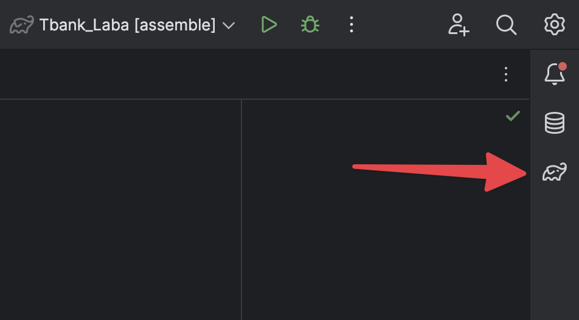
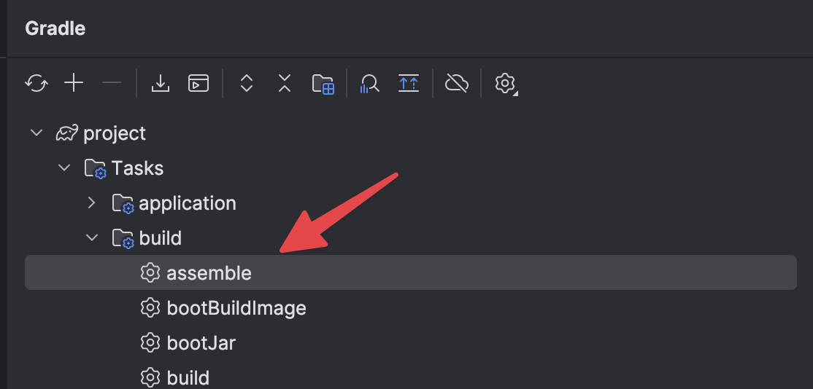
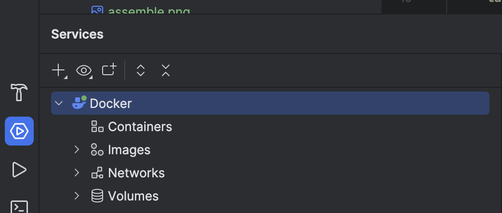
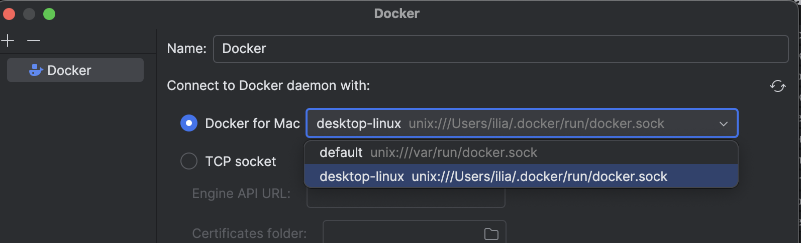
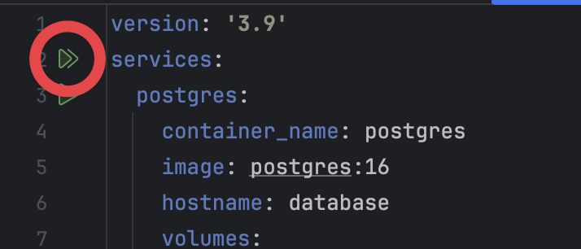
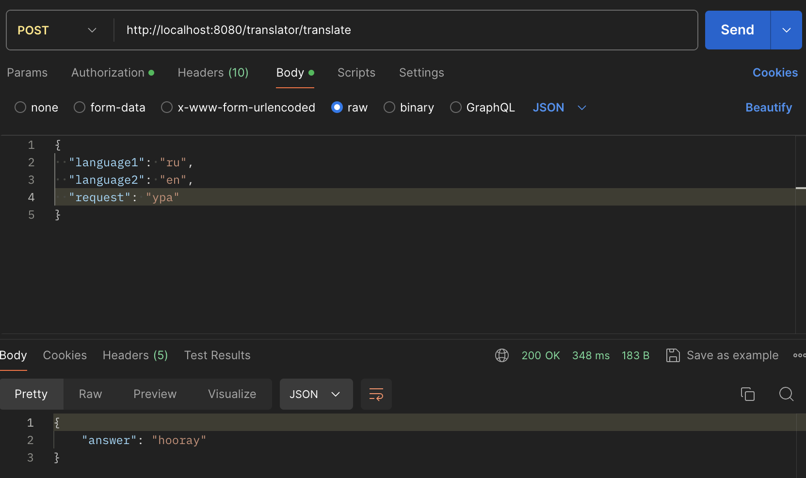

# Лабораторная работа для Финтех-курса Java-разработчик

## Перед началом запуска
Вам необходимо установить себе на компьютер приложения Docker Desktop ([ссылка на официальный сайт](https://www.docker.com/products/docker-desktop/)) и Postman ([ссылка на официальный сайт](https://www.postman.com/downloads/)).

Для доступа к API Яндекс Переводчика необходимо иметь Api-Key и folderId. Инструкция для получения:
* [Зайдите на сайт Yandex Cloud](https://yandex.cloud/ru/)
* Зарегистрируйтесь или войдите в свой аккаунт
* Перейдите в консоль управления (кнопка "Консоль" слева от фотографии профиля)
* Создайте платежный аккаунт
* Создайте каталог, ID каталога - это folderId
* В каталоге перейдите в раздел Сервисные аккаунты и создайте новый сервисный аккаунт, указав роль ai.translate.user
* Перейдите в созданный сервисный аккаунт и в верхнем правом углу нажмите кнопку с плюсом "Создать новый ключ"
* Созданный ключ - это Api-Key

[Более подробно о получении токена](https://yandex.cloud/ru/docs/translate/operations/sa-api-key)

## Как запустить
Откройте файл application.yaml (src -> main -> resources -> application.yaml). В переменную YANDEX_FOLDER_ID вставьте ваш folderId, в YANDEX_API_KEY - ваш Api-Key.

Далее откройте панель Gradle (значок слоника справа). В ней откройте Tasks -> build -> assemble (дважды щелкнуть). После создания билда можно двигаться дальше.





### Важно для владельцев Mac/Linux:
``
Если вы используете Mac/Linux, то выполните действие ниже (с файлом docker-compose). После этого у вас скорее всего выдаст ошибку. Если этого не произошло, можно двигаться дальше. Если это произошло выполните следующее: в нижнем левом углу необходимо выбрать панель Services, нажать ПКМ на Docker и выбрать Edit Configuration. В открывшемся окне выбрать в Docker for Mac настройку desktop-linux вместо default. После этого выполните шаг ниже еще раз и продолжайте следовать инструкциям
``





Со следующим шагом могут возникнуть проблемы на Mac/Linux, читайте инструкцию выше

Откройте файл docker-compose.yml в корневой папке проекта (предварительно необходимо запустить приложение Docker Desktop). Нажмите кнопку запуска напротив services (двойной зеленый треугольник). Дождитесь создания контейнера.




Откройте приложение Postman, выберете POST запрос и напишите адрес "http://localhost:8080/translator/translate".

В Body напишите JSON файл следующего содержания:

```
{
    "language1": "ru",
    "language2": "en",
    "request": "Привет"
}
```
Где "language1" - язык, с которого хотите перевести, "language2" - язык, на который хотите перевести, "request" - текст для перевода.

Нажмите кнопку "Send". В ответ вы получите переведенную строку либо текст ошибки.




